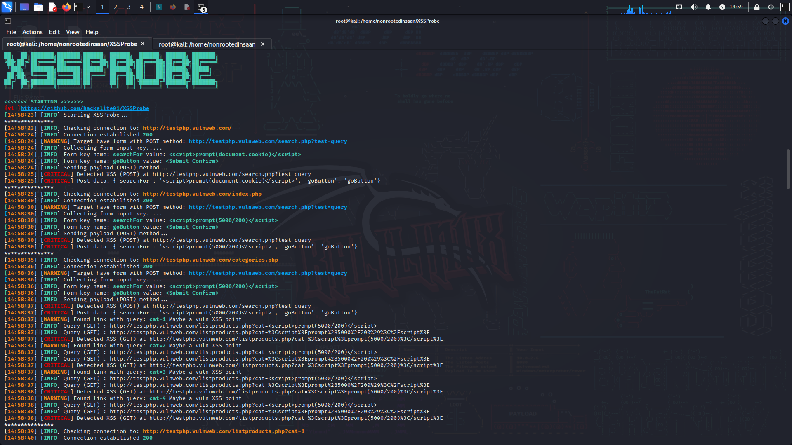

  
## A powerful XSS scanner made in Python 3 🔍
[](https://www.codefactor.io/repository/github/hackelite01/xssprobe)



## ✨ Latest Improvements (v2.0)

- **🔒 Enhanced Security**: Removed dangerous `eval()` usage, improved input validation
- **🎯 Type Safety**: Added comprehensive type hints throughout codebase  
- **🛡️ Better Error Handling**: Robust exception handling for network requests
- **🏗️ Clean Architecture**: Eliminated global variables, improved class structure
- **📊 DOM XSS Detection**: Advanced client-side XSS vulnerability detection
- **⚡ Performance**: Better resource management and error recovery

## Installing 

### Requirements
- Python 3.7+
- BeautifulSoup4 >= 4.9.0
- requests >= 2.25.0
- lxml >= 4.6.0

### Quick Install
```bash
# Clone repository
git clone https://github.com/hackelite01/XSSProbe
cd XSSProbe

# Install dependencies
pip install -r requirements.txt

# Make executable (Linux/Mac)
chmod +x xssprobe.py

# Run help
python xssprobe.py --help 
```

### Alternative Install
```bash
# Install individual packages
pip install beautifulsoup4 requests lxml
```
## Usage
Basic usage:

```bash
python3 xssprobe.py -u http://testphp.vulnweb.com
```
<br/>
Advanced usage:

```bash
python3 xssprobe.py --help
```

## 🚀 Main Features

* **🕷️ Smart Crawling**: Intelligent website crawling with depth control
* **📝 Form Testing**: Comprehensive POST and GET form vulnerability testing  
* **🎨 DOM XSS Detection**: Advanced client-side XSS vulnerability detection
* **⚙️ Customizable**: Flexible payload levels and scanning methods
* **🔧 Robust Error Handling**: Graceful handling of network issues and edge cases
* **⚡ Multiprocessing**: Parallel scanning for improved performance
* **🎯 Type Safety**: Full type hints for better code reliability
* **📊 Detailed Reporting**: Comprehensive vulnerability reports
* **🛡️ Security First**: No dangerous code execution, safe by design

## 📖 Usage Examples

### Basic Scan
```bash
python xssprobe.py -u http://testphp.vulnweb.com
```

### Advanced Scan with DOM XSS
```bash
python xssprobe.py -u http://target.com --dom-xss --depth 3 --payload-level 6
```

### Custom Payload
```bash
python xssprobe.py -u http://target.com --payload "<script>alert('XSS')</script>"
```

### Scan with Proxy
```bash
python xssprobe.py -u http://target.com --proxy '{"http":"http://127.0.0.1:8080","https":"http://127.0.0.1:8080"}'
```

## 🔧 Configuration

The tool now includes a configuration system in `lib/config.py` for easy customization of:
- Default timeouts and rate limits
- Output file locations  
- HTTP headers and user agents
- Payload collections
- SSL verification settings

## ⚠️ Security Notes

- **v2.0** removes all dangerous code execution vulnerabilities
- SSL verification is disabled by default for testing - enable for production
- Use responsibly and only on systems you own or have permission to test

